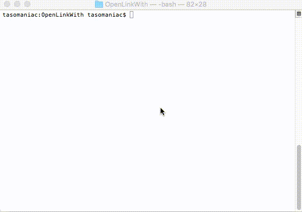

thefuck-gradle
==============

The Fuck rule for Gradle

As simple as the tool the fuck. [The Fuck][fuck] is a magnificent app which corrects your previous console command.

Usage
-----

When you type a Gradle task wrong, just type `fuck` after that and corrected task will be run. 



Install
-------

Copy the `gradle.py` file to `~/.thefuck/rules/` folder.

We need to enable it now:

### 1. Easy way

Add an environment variable. In environment variable, you can directly add `DEFAULT_RULES`. Here is how:

```
export THEFUCK_RULES=DEFAULT_RULES:gradle
```
This was, you will keep your default fuck rules and `gradle` will only be an addition. 

### 2. Moar config

Edit `~/.thefuck/settings.py` file to modify more settings. 

```
rules = ['gradle']
require_confirmation = False
wait_command = 10
no_colors = False
debug = False
```

Although this has many more configuration, I couldn't find a way to keep the default fuck rules. It seems that the only was is to list all the rules you want manually. 

License
-------

    Copyright (C) 2016 Said Tahsin Dane

    Licensed under the Apache License, Version 2.0 (the "License");
    you may not use this file except in compliance with the License.
    You may obtain a copy of the License at

       http://www.apache.org/licenses/LICENSE-2.0

    Unless required by applicable law or agreed to in writing, software
    distributed under the License is distributed on an "AS IS" BASIS,
    WITHOUT WARRANTIES OR CONDITIONS OF ANY KIND, either express or implied.
    See the License for the specific language governing permissions and
    limitations under the License.


[fuck]: https://github.com/nvbn/thefuck
